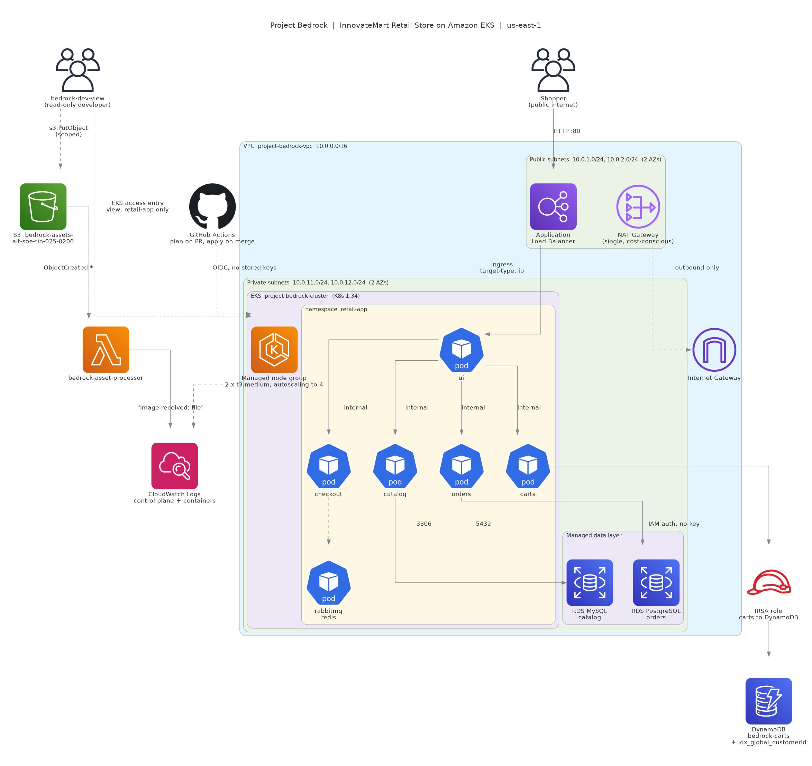

# Project Bedrock

Production-grade microservices platform on Amazon EKS, running the AWS
Retail Store Sample Application against managed AWS data services.

AltSchool of Engineering, Tinyuka 2025, Third Semester Capstone.
Student ID: ALT/SOE/TIN/025/0206

## What this builds

An EKS cluster in a purpose-built VPC, running the retail store sample
application with its in-cluster databases replaced by RDS MySQL, RDS
PostgreSQL and DynamoDB. Traffic arrives through an Application Load
Balancer created by the AWS Load Balancer Controller. Control plane and
container logs ship to CloudWatch. A read-only developer identity can
inspect the application namespace but change nothing. Uploads to an S3
bucket trigger a Lambda function. Infrastructure changes are planned on
pull request and applied on merge, authenticated by GitHub OIDC with no
long-lived credentials stored anywhere.

## Fixed constraints

| Resource | Value |
| --- | --- |
| AWS region | us-east-1 |
| EKS cluster | project-bedrock-cluster |
| VPC name tag | project-bedrock-vpc |
| Kubernetes version | 1.34 (oldest in standard support at deploy time) |
| Namespace | retail-app |
| Developer IAM user | bedrock-dev-view |
| Assets bucket | bedrock-assets-alt-soe-tin-025-0206 |
| Lambda function | bedrock-asset-processor |
| Tag on all resources | Project: tinyuka-2025-capstone |

## Architecture



The diagram is generated from `docs/architecture.py` using the Python
`diagrams` library, so it can be regenerated when the platform changes
rather than redrawn by hand.

## Repository layout

| Path | Contents |
| --- | --- |
| `terraform/` | Root configuration and six modules |
| `terraform/modules/networking/` | VPC, subnets, IGW, NAT, route tables |
| `terraform/modules/eks/` | Cluster, OIDC provider, managed node group |
| `terraform/modules/data/` | RDS MySQL, RDS PostgreSQL, DynamoDB, SSM parameters |
| `terraform/modules/serverless/` | Assets bucket, Lambda, S3 trigger |
| `terraform/modules/iam/` | Developer user, access entry, carts IRSA role |
| `terraform/modules/observability/` | CloudWatch add-on, log retention |
| `helm/retail-store/` | Umbrella chart with five vendored subcharts |
| `kubernetes/base/` | Namespace and Load Balancer Controller service account |
| `lambda/` | Source for bedrock-asset-processor |
| `.github/workflows/` | Plan on pull request, apply on merge |
| `scripts/` | Deployment and secret creation |
| `docs/` | Architecture diagram and its source |
| `evidence/` | Screenshots demonstrating each requirement |

## Prerequisites

- Terraform 1.11 or later (1.15.7 used here; the S3 backend uses
  `use_lockfile`, which needs 1.11 and removes the need for a DynamoDB
  lock table)
- AWS CLI v2, authenticated with permission to create the resources below
- kubectl 1.34, matching the cluster version
- Helm 4 (4.2.3 used here)
- An S3 bucket for Terraform state, created by hand before anything else

The state bucket is the single resource in this project not created by
Terraform, and it has to be: Terraform needs somewhere to record what it
creates before it can create anything. It is created once with:

```bash
aws s3api create-bucket --bucket bedrock-tfstate-joshfadero --region us-east-1
aws s3api put-bucket-versioning --bucket bedrock-tfstate-joshfadero \
  --versioning-configuration Status=Enabled
aws s3api put-public-access-block --bucket bedrock-tfstate-joshfadero \
  --public-access-block-configuration \
  "BlockPublicAcls=true,IgnorePublicAcls=true,BlockPublicPolicy=true,RestrictPublicBuckets=true"
```

Note that us-east-1 is the one region that rejects the
`--create-bucket-configuration LocationConstraint` flag. Every other
region requires it.

## Deployment guide

### 1. Provision the infrastructure

```bash
cd terraform
terraform init
terraform plan          # expect 43 resources on a clean build
terraform apply
```

Takes 25 to 40 minutes on a first run. The EKS control plane is the long
pole at 10 to 12 minutes; RDS instances run 8 to 12 minutes in parallel.

**Known first-run failure.** EKS creates the control plane log group
itself the moment logging is enabled, and Terraform tries to create the
same one, failing with `ResourceAlreadyExistsException`. Import it and
re-apply:

```bash
terraform import module.observability.aws_cloudwatch_log_group.control_plane \
  /aws/eks/project-bedrock-cluster/cluster
terraform apply
```

### 2. Install the AWS Load Balancer Controller

The controller creates the ALB in response to the Ingress resource. It is
not managed by Terraform, and its IAM policy must match the controller
version being installed.

```bash
CONTROLLER_VERSION=v3.5.0
curl -o /tmp/lbc-policy.json \
  https://raw.githubusercontent.com/kubernetes-sigs/aws-load-balancer-controller/${CONTROLLER_VERSION}/docs/install/iam_policy.json

aws iam create-policy --policy-name AWSLoadBalancerControllerIAMPolicy-bedrock \
  --policy-document file:///tmp/lbc-policy.json

# Trust policy scoped to the controller service account, then:
aws iam create-role --role-name AmazonEKSLoadBalancerControllerRole-bedrock \
  --assume-role-policy-document file:///tmp/lbc-trust.json
aws iam attach-role-policy --role-name AmazonEKSLoadBalancerControllerRole-bedrock \
  --policy-arn arn:aws:iam::<account>:policy/AWSLoadBalancerControllerIAMPolicy-bedrock

kubectl apply -f kubernetes/base/lbc-serviceaccount.yaml
helm repo add eks https://aws.github.io/eks-charts && helm repo update
helm install aws-load-balancer-controller eks/aws-load-balancer-controller \
  -n kube-system \
  --set clusterName=project-bedrock-cluster \
  --set serviceAccount.create=false \
  --set serviceAccount.name=aws-load-balancer-controller \
  --set region=us-east-1 \
  --set vpcId=<vpc-id-from-terraform-output>
```

Pin the policy version to the controller version. Fetching the policy for
one version while Helm installs another produces `AccessDenied` on API
actions the older policy has never heard of.

### 3. Deploy the application

```bash
./scripts/deploy-app.sh
```

One command. It points kubectl at the cluster, creates the namespace,
reads both database passwords from SSM Parameter Store into Kubernetes
Secrets, installs the vendored Helm chart, waits for the rollout, and
prints the store URL.

**The URL must be opened with an explicit `http://` prefix.** No TLS
listener is configured, so a browser that silently upgrades the request
to HTTPS will time out rather than failing visibly.

### 4. Triggering the pipeline

- Open a pull request touching `terraform/`. The plan runs and is posted
  as a comment on the pull request.
- Merge it. The apply runs against live infrastructure.

Both workflows authenticate through GitHub OIDC. No AWS access keys are
stored as repository secrets.

## Teardown guide

**Order matters.** The ALB is created by the Load Balancer Controller in
response to the Ingress, so Terraform has no record of it. Destroying the
VPC while the ALB still exists leaves its network interfaces attached,
and the destroy hangs for twenty minutes before failing with an error
that never mentions the load balancer.

### 1. Remove the application and wait for the ALB to disappear

```bash
helm uninstall retail-store -n retail-app
kubectl delete namespace retail-app

# Confirm the load balancer is gone before continuing
aws elbv2 describe-load-balancers --region us-east-1 \
  --query "LoadBalancers[?contains(LoadBalancerName,'k8s-retailap')].LoadBalancerName" \
  --output text
```

Wait until that returns nothing. Usually two to three minutes.

### 2. Remove the controller and the autoscaler

```bash
helm uninstall aws-load-balancer-controller -n kube-system
helm uninstall cluster-autoscaler -n kube-system
```

### 3. Destroy the infrastructure

```bash
cd terraform
terraform destroy
```

Ten to fifteen minutes. RDS instances have `skip_final_snapshot = true`
and `deletion_protection = false` so teardown does not stall; the assets
bucket has `force_destroy = true` for the same reason.

### 4. Resources not managed by Terraform

These survive `terraform destroy` and must be removed by hand if the
account is to be left clean:

```bash
# IAM roles and policies created by CLI
aws iam detach-role-policy --role-name AmazonEKSLoadBalancerControllerRole-bedrock \
  --policy-arn arn:aws:iam::<account>:policy/AWSLoadBalancerControllerIAMPolicy-bedrock
aws iam delete-role --role-name AmazonEKSLoadBalancerControllerRole-bedrock
aws iam delete-policy --policy-arn arn:aws:iam::<account>:policy/AWSLoadBalancerControllerIAMPolicy-bedrock

aws iam detach-role-policy --role-name ClusterAutoscalerRole-bedrock \
  --policy-arn arn:aws:iam::<account>:policy/ClusterAutoscalerPolicy-bedrock
aws iam delete-role --role-name ClusterAutoscalerRole-bedrock
aws iam delete-policy --policy-arn arn:aws:iam::<account>:policy/ClusterAutoscalerPolicy-bedrock

aws iam delete-role --role-name github-actions-bedrock
aws iam delete-open-id-connect-provider \
  --open-id-connect-provider-arn arn:aws:iam::<account>:oidc-provider/token.actions.githubusercontent.com

# The developer access key, once grading is complete
aws iam delete-access-key --user-name bedrock-dev-view --access-key-id <key-id>

# The state bucket, emptied first because versioning retains old objects
aws s3 rm s3://bedrock-tfstate-joshfadero --recursive
aws s3api delete-bucket --bucket bedrock-tfstate-joshfadero --region us-east-1
```

### Partial teardown

The expensive components are the VPC and NAT Gateway, the EKS cluster and
nodes, both RDS instances, and the ALB, together roughly $0.31 per hour.
The assets bucket, Lambda, DynamoDB table and IAM identities cost almost
nothing and can be left running, which keeps the serverless flow and the
developer credentials verifiable while the cluster is down.

## Design notes and honest limitations

### Credentials

Database passwords are generated by Terraform, stored as encrypted SSM
parameters, and read into Kubernetes Secrets at deploy time. No password
is typed by a human, written into a values file, or committed. SSM
Parameter Store was chosen over Secrets Manager because it is free at
this scale and has no deletion recovery window, so a destroy and rebuild
cycle cannot be blocked by a name reserved by a deleted secret.

The generated passwords do appear in the Terraform state file, which is
unavoidable with `random_password`. The state bucket is therefore
private, versioned, encrypted, and has all four public access blocks set.

Root outputs are limited to the five values the specification requires.
`terraform output -json` prints values in full even when marked
sensitive, and that output is committed as `grading.json`, so any
credential promoted to a root output would be published permanently.
Values needed at deploy time but not graded, such as the RDS endpoints
and the carts role ARN, are read from module state instead.

### Pipeline identity

GitHub Actions authenticates through OIDC. There is no AWS access key
stored as a repository secret. The trust policy is scoped by subject to
this repository only.

The role carries AdministratorAccess, which is not least privilege. The
pipeline runs Terraform across ten AWS services and creates IAM roles;
scoping that properly is a project of its own. The mitigation is that no
long-lived credential exists anywhere and only runs originating from this
repository can assume the role.

One detail worth recording: GitHub embeds numeric IDs in the OIDC subject
claim, so the documented `repo:owner/name:ref:...` format does not match
what is actually presented. The working condition is
`repo:owner@<id>/name@<id>:*`. This was found by decoding the token in a
workflow step rather than by reasoning about the format.

### Bonus objectives

**5.1 Helm.** Complete. The umbrella chart and its five subcharts are
vendored into `helm/retail-store/`, so no external chart repository is
needed at install time, and the whole application deploys with a single
`helm upgrade --install`.

**5.3 Cluster autoscaling.** Complete. The Cluster Autoscaler is
installed with IRSA and discovers the node group by tag. Scaling the UI
deployment to twelve replicas produced five unschedulable pods, and a
third node was provisioned and joined the cluster within four minutes.
The autoscaler removed it again once demand fell.

Note that the autoscaler modifies the node group's desired size directly,
which Terraform then sees as drift. In a longer-lived system the node
group would carry
`lifecycle { ignore_changes = [scaling_config[0].desired_size] }`.

**5.5 Resilience.** Complete. Deleting the UI pod produced an automatic
replacement, which passed through two transient errors while waiting for
its init containers and reached Running without intervention. The store
returned HTTP 200 immediately afterwards. Both RDS instances have
automated backups with seven day retention.

**5.4 Network policies.** Attempted, not achieved. VPC CNI network policy
enforcement was enabled (`ENABLE_NETWORK_POLICY=true`, agent running,
CNI v1.21.2) and application pods were recreated afterwards so
enforcement hooks would attach. A deny-all policy was then applied and a
pod-to-pod connection was retested: it still succeeded, so the policy was
not being enforced. Rather than commit policies that look rigorous and
block nothing, the attempt is recorded and the objective left incomplete.

**5.2 TLS via ACM.** Deliberately skipped. ACM issues public certificates
only for domains whose ownership can be validated, and nobody can
validate `nip.io`. The available workaround is to import a self-signed
certificate into ACM and attach it to the ALB, which satisfies the letter
of the objective but presents every visitor with a browser security
warning. For a platform whose primary requirement is that the store is
reachable and demonstrably working, a full-page "your connection is not
private" interstitial was judged a worse outcome than plain HTTP.

### Other known deviations

- `hash_key` on the DynamoDB table is deprecated in favour of
  `key_schema`. The provider is pinned to `~> 6.0`, where the argument
  still works, so it was left rather than rewritten under deadline.
- The Load Balancer Controller, the Cluster Autoscaler, and their IAM
  roles are created outside Terraform. They survive `terraform destroy`
  and are listed in the teardown guide. Moving them into the IAM module
  would remove that manual step.
- The UI runs a single replica, so pod replacement is not strictly
  zero-downtime. Two replicas with the existing rolling update strategy
  would close that gap.

### A finding worth recording

The retail store UI serves built-in placeholder data when it is not told
where its backend services are. The chart's `app.endpoints` map defaults
to empty, so the store rendered products, accepted basket additions and
produced a plausible order ID while never contacting catalog, carts or
orders. Every pod was healthy and every log was clean.

The only thing that exposed it was scanning the DynamoDB table directly
and finding it empty while an item sat in the basket on screen. The
lesson generalises: verify at the layer you are claiming, not the layer
you can see.
